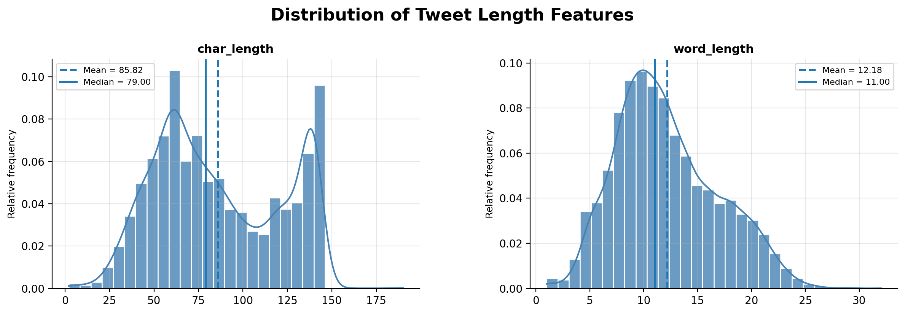
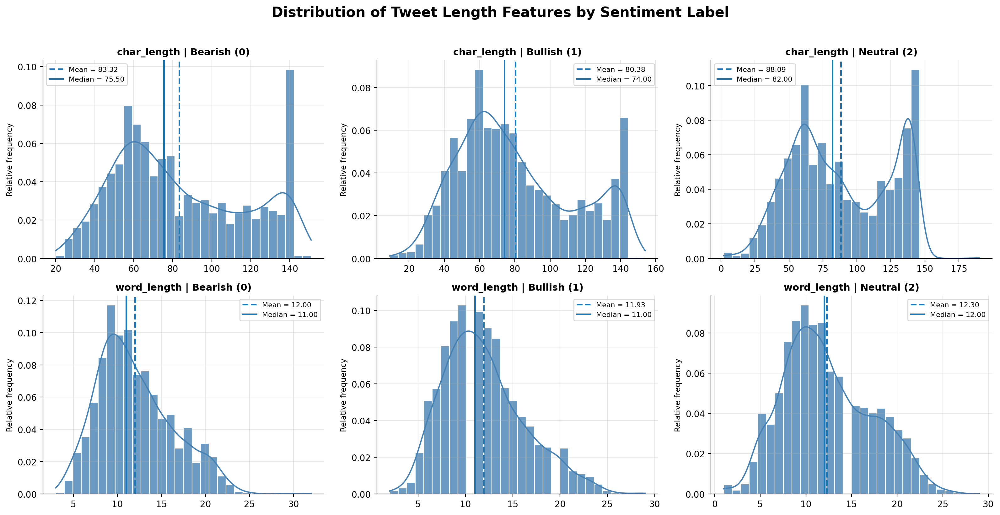
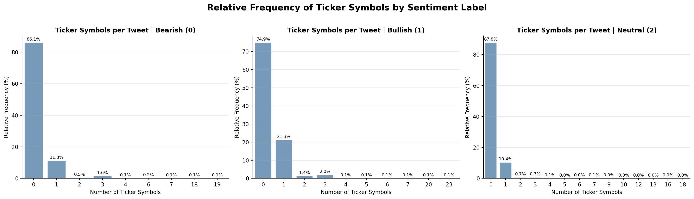
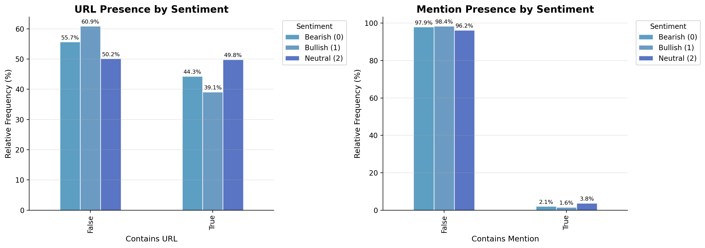

# Data Exploration Report

This report summarizes section `1. Data Exploration` from `notebooks/workflow.ipynb`. The goal is to understand the dataset structure, class balance, text-length behavior, and simple tweet-level signals before preprocessing and feature engineering.

## Dataset Overview

The project uses a labelled financial tweet training dataset and an unlabelled test dataset.

| Dataset | Rows | Columns |
| --- | ---: | ---: |
| Train | 9,543 | 2 |
| Test | 2,388 | 2 |

The training data contains two columns:

| Column | Type | Description |
| --- | --- | --- |
| `text` | string | Financial tweet text |
| `label` | integer | Sentiment class |

The sentiment labels are:

| Label | Sentiment |
| ---: | --- |
| `0` | Bearish |
| `1` | Bullish |
| `2` | Neutral |

There are no missing values in the training data: all `9,543` rows have a tweet text and sentiment label.

## Class Balance

The class distribution is imbalanced:

| Sentiment | Label | Proportion |
| --- | ---: | ---: |
| Neutral | `2` | 64.7% |
| Bullish | `1` | 20.2% |
| Bearish | `0` | 15.1% |

Neutral tweets dominate the dataset, while Bearish tweets are the smallest class. This matters for evaluation: accuracy alone can overstate performance because a model can score well by favoring the majority Neutral class. Macro-averaged metrics should therefore be used alongside accuracy to check whether the model performs acceptably across all sentiment categories.

## Tweet Length Distributions

Figure: Overall character and word length distributions for the training tweets.

The tweets are short, as expected for financial social-media text. The median tweet length is approximately `79` characters and `11` words. Both length distributions are only moderately right-skewed, with skewness values of `0.217` for character length and `0.454` for word length.

The character-length distribution also appears bimodal. One concentration occurs around `60-80` characters, while another appears near `130-145` characters. This likely reflects different communication styles in the corpus: short market comments, analyst calls, headline-style news snippets, and longer posts that include tickers, hashtags, or links.

## Tweet Length by Sentiment

Figure: Character and word length distributions split by Bearish, Bullish, and Neutral labels.

Tweet length is similar across sentiment classes. Average character lengths range from roughly `80` to `88` characters, and average word counts remain close to `12-12.3` words per tweet. Neutral tweets are marginally longer on average, but the distributions overlap heavily.

This suggests that tweet length is not a strong standalone predictor of sentiment. Length may still provide weak auxiliary signal, but the main classification signal is expected to come from vocabulary and semantic content.

## Frequent Terms by Sentiment

The most frequent raw terms show clearer sentiment differences than the length features.

Bearish tweets contain negative market terms such as `down` and `misses`, which are consistent with adverse price movement, earnings disappointment, or analyst downgrades.

Bullish tweets contain positive market terms such as `up`, `beats`, `price`, and `target`, which are associated with positive market movement, earnings outperformance, and upward price expectations.

Neutral tweets contain more informational terms such as `results`, `earnings`, `new`, and `#stock`, suggesting that this class is often made up of news-style reporting rather than explicit positive or negative opinion.

The practical implication is that feature engineering should prioritize token-level and phrase-level representations. The dataset has meaningful vocabulary differences across sentiment labels.

## Ticker Symbols

Figure: Relative frequency of ticker-symbol counts by sentiment label.

Most tweets do not contain explicit stock ticker symbols. However, Bullish tweets have the highest proportion of posts with exactly one ticker symbol, at approximately `21.3%`, compared with `11.3%` for Bearish tweets and `10.4%` for Neutral tweets.

Neutral and Bearish tweets are more likely to contain no ticker references, with approximately `87.8%` of Neutral tweets and `86.1%` of Bearish tweets having zero tickers. Tweets containing multiple ticker symbols are uncommon across all classes and generally account for less than `2%` of observations.

Ticker symbols may therefore be useful as a complementary feature, especially for Bullish detection, but they should not be treated as a primary signal because most tweets do not contain them.

## URL and Mention Presence

Figure: Relative frequency of URL and user-mention presence by sentiment label.

URLs are common in the corpus. Around half of all tweets contain a link, which indicates that the dataset includes substantial news-sharing or information-distribution behavior. Bullish tweets have the highest URL presence at approximately `60.9%`, compared with `55.7%` for Bearish tweets and `50.2%` for Neutral tweets.

User mentions are rare. More than `96%` of tweets in every class do not contain a mention, with only about `1.6-3.8%` of observations including one. Mentions are therefore unlikely to be a strong predictive feature.

URL presence may help as an auxiliary feature, but mention presence is likely too sparse to matter much.

## Conclusion

The exploration shows that sentiment is driven mainly by semantic content rather than simple structural properties. Tweet length is similar across labels, while frequent vocabulary differs clearly between Bearish, Bullish, and Neutral tweets.

For the next stages, the strongest direction is to focus on text representations that preserve financial vocabulary, market direction terms, and headline-style phrasing. Structural features such as ticker count and URL presence can be added as secondary signals, but they should complement the text representation rather than replace it.
